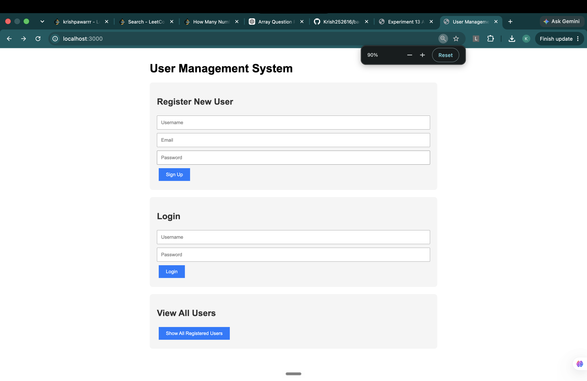
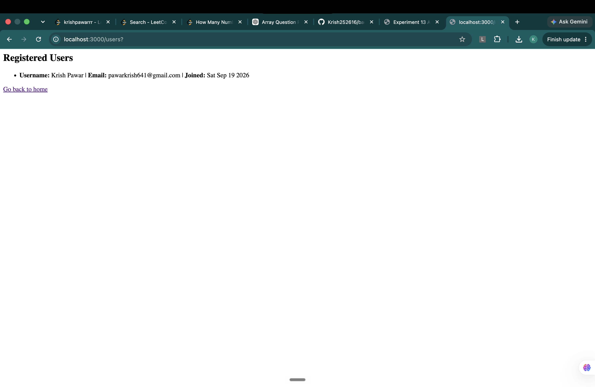

# Experiment — Build a user management system with MongoDB and Mongoose

**Course:** Backend Development Lab
**Student:** Krish Pawar · B.Tech CSE · UPES Dehradun · 590017543
**Date:** 19 September 2026

**Source:** [`server.js`](./server.js)

---

## 1. Aim

To connect a Node.js/Express application to a local MongoDB database using Mongoose, define a
schema and model for user data, and implement signup, login and list-users routes that persist and
retrieve documents from the database.

## 2. Objectives

After completing this experiment, I am able to:

1. Install and run MongoDB locally as a background service on macOS.
2. Initialise a Node.js project and install Mongoose as a dependency.
3. Connect an Express application to MongoDB using a connection string.
4. Define a Mongoose schema with field types, validators and defaults.
5. Compile a schema into a model and use it to create and query documents.
6. Handle database errors, including duplicate-key violations.

## 3. Tools and environment

| Item | Detail |
|---|---|
| Runtime | Node.js (installed via Homebrew) |
| Framework | Express |
| Database | MongoDB Community Edition 8.0, running locally |
| ODM | Mongoose |
| Package manager | npm |
| Editor | Visual Studio Code |
| OS | macOS |
| Database URI | `mongodb://localhost:27017/userdb` |

---

## 4. Theory

### 4.1 Why MongoDB is different

MongoDB is a **document database**. Instead of tables with fixed columns, it stores **documents**
in **collections**. Each document is a BSON object — essentially JSON with extra data types — and
documents in the same collection need not share the same fields.

| Relational (SQL) | MongoDB |
|---|---|
| Database | Database |
| Table | Collection |
| Row | Document |
| Column | Field |
| `JOIN` | Embedding or `$lookup` |
| Schema enforced by the database | Schema enforced by the application (via Mongoose) |

This last row matters. MongoDB itself will happily accept any shape of document. The structure in
this experiment is enforced by **Mongoose**, not by the database engine.

### 4.2 What Mongoose adds

Mongoose is an **ODM** — Object Document Mapper. It sits between the application and the MongoDB
driver and provides three things the raw driver does not:

1. **Schemas** — a declared structure with types, so `age` cannot accidentally be saved as a string.
2. **Validation** — `required`, `min`, `max`, `match` and custom validators, checked before a write.
3. **Models** — a class-like interface (`User.find()`, `user.save()`) instead of raw collection calls.

### 4.3 The three-layer chain

```
Schema  →  defines the shape of a document
   ↓
Model   →  compiled from the schema; the interface for queries
   ↓
Document → a single instance created from the model
```

In code:

```javascript
const userSchema = new mongoose.Schema({ ... });   // 1. schema
const User = mongoose.model('User', userSchema);   // 2. model
const newUser = new User({ username, email, ... }); // 3. document
await newUser.save();                               //    persisted
```

**Note on collection naming:** `mongoose.model('User', ...)` creates a collection called
**`users`** — Mongoose lowercases the model name and pluralises it automatically. This catches
people out when they go looking for a `User` collection in the database and find nothing.

---

## 5. Procedure

1. Installed Node.js on the system and verified with `node -v` and `npm -v`.
2. Installed MongoDB Community Edition 8.0 via Homebrew:
   ```bash
   brew tap mongodb/brew
   brew install mongodb-community@8.0
   ```
3. Created the project folder and initialised it:
   ```bash
   mkdir mongoose-demo
   cd mongoose-demo
   npm init -y
   ```
   `npm init` does not install Node — it creates `package.json`, which records the project's
   metadata and its dependency list.
4. Installed the dependencies:
   ```bash
   npm install express mongoose
   ```
5. Created `server.js` and studied Mongoose schemas, models and documents.
6. Wrote the application: connection, schema, model, and four routes.
7. Started MongoDB as a background service:
   ```bash
   brew services start mongodb-community@8.0
   brew services list        # confirm status is "started"
   ```
8. Ran the server with `node server.js` and opened `http://localhost:3000`.
9. Registered a user, logged in with those credentials, and listed all users to confirm the data
   had persisted.

---

## 6. Code walkthrough

### 6.1 Connecting

```javascript
const DB_URL = 'mongodb://localhost:27017/userdb';

mongoose.connect(DB_URL)
  .then(() => console.log('Connected to MongoDB successfully'))
  .catch(err => console.error('MongoDB connection error:', err));
```

The URI breaks down as `mongodb://` (protocol) + `localhost:27017` (host and default MongoDB port)
+ `/userdb` (database name). The database does not need to exist beforehand — MongoDB creates it
lazily, on the first write.

### 6.2 The schema

```javascript
const userSchema = new mongoose.Schema({
  username: { type: String, required: true, unique: true },
  email:    { type: String, required: true, unique: true },
  password: { type: String, required: true },
  createdAt:{ type: Date,   default: Date.now }
});
```

| Option | Effect |
|---|---|
| `type` | The expected data type; Mongoose casts or rejects on mismatch |
| `required: true` | Save is rejected if the field is missing |
| `unique: true` | Builds a unique **index** — see the note below |
| `default: Date.now` | Sets the value automatically if none is supplied |

`default: Date.now` passes the **function**, not `Date.now()`. Calling it would freeze the value at
server start-up so every user would share the same timestamp.

### 6.3 The routes

| Method | Path | Mongoose operation |
|---|---|---|
| GET | `/` | none — serves the HTML form |
| POST | `/signup` | `new User({...})` then `.save()` |
| POST | `/login` | `User.findOne({ username })` |
| GET | `/users` | `User.find()` — no filter, returns all |

Every database call is `await`ed inside a `try…catch`, because database operations are
asynchronous and can fail.

### 6.4 Handling duplicates

```javascript
if (error.code === 11000) {
  // duplicate username or email
}
```

`11000` is MongoDB's duplicate-key error code. It is raised by the **database index**, not by
Mongoose validation, which is why it needs its own branch in the catch block rather than being
caught by a validator.

---

## 7. Output

Server started on port 3000 with `Connected to MongoDB successfully` logged to the console.

| Action | Result |
|---|---|
| Register a new user | Success page showing the username and email |
| Register the same username again | Error: username or email already exists |
| Login with correct credentials | Welcome page with email and account creation date |
| Login with a wrong password | "Incorrect password" |
| Login with an unregistered username | "User not found" |
| View all users | List of every registered user with join date |

### Screenshots



*Home page served by `GET /` — three forms rendered by Express.*



*`GET /users` — data read back from MongoDB via `User.find()`, proving the document persisted.*

The data survived a server restart, confirming it was written to disk rather than held in memory.

---

## 8. Observations

1. **The database is created on first write, not on connect.** Naming `userdb` in the URI does not
   create it; the first `save()` does. Running `show dbs` before any signup lists nothing.

2. **`unique: true` is not a validator.** It is shorthand for building a unique index. That means
   two things: the error arrives as code `11000` rather than a Mongoose `ValidationError`, and if
   duplicate documents already exist in the collection, the index silently fails to build.

3. **Passwords are stored in plain text, and that is a real flaw.** This version stores whatever the
   user typed and compares with `user.password !== password`. Anyone with database access — or
   anyone who obtains a dump of it — reads every password directly. Production code hashes the
   password with **bcrypt** or **argon2** before saving and compares with the library's own
   `compare()` function. Worth fixing in the next iteration.

4. **Homebrew's versioned formula name must be used exactly.** The package installed was
   `mongodb-community@8.0`, so `brew services start mongodb-community` fails with "Formula not
   installed" — the `@8.0` suffix is part of the name.

5. **Running `mongod` manually is not the same as starting the service.** A bare `mongod` looks for
   the default data directory `/data/db`, which does not exist on macOS, and exits with code 100.
   `brew services` supplies the correct config file and data path.

6. **Mongoose pluralises the collection name.** `mongoose.model('User', ...)` writes to a collection
   named `users`.

---

## 9. Mongoose key concepts

| Concept | What it is |
|---|---|
| Schema | Declaration of a document's structure, types and rules |
| Model | Compiled schema; the query interface for a collection |
| Document | A single record; an instance of a model |
| Validator | A rule checked before a write (`required`, `min`, `match`, custom) |
| Middleware / hooks | Functions that run before or after an operation (`pre('save')`, `post('save')`) |
| Query | A chainable builder (`Model.find().sort().limit()`) |

### Common methods used or studied

| Method | Purpose |
|---|---|
| `Model.find(filter)` | Returns an array of matching documents (empty array if none) |
| `Model.findOne(filter)` | Returns the first match, or `null` |
| `Model.findById(id)` | Finds by `_id` |
| `new Model({...})` + `.save()` | Creates and persists a document |
| `Model.create({...})` | Shorthand for the two steps above |
| `Model.updateOne(filter, update)` | Updates the first match |
| `Model.findByIdAndUpdate(id, update)` | Updates and returns the document |
| `Model.deleteOne(filter)` | Deletes the first match |
| `Model.countDocuments(filter)` | Counts matches without fetching them |

`find()` returning an empty array while `findOne()` returns `null` is a common source of bugs —
`if (!result)` works for `findOne` but not for `find`, where the check must be `result.length === 0`.

---

## 10. Conclusion

A working user management system was built on Node.js, Express, MongoDB and Mongoose. MongoDB was
installed and run as a background service; a Mongoose schema and model were defined for user data;
and signup, login and list routes were implemented that create and query documents. Data persisted
across server restarts, confirming it was written to the database rather than held in memory. All
six objectives were met.

The main limitation identified is plain-text password storage, which should be replaced with bcrypt
hashing before this pattern is used anywhere real.

---

## 11. References

1. MongoDB — *Manual*. <https://www.mongodb.com/docs/manual/>
2. Mongoose — *Documentation*. <https://mongoosejs.com/docs/>
3. Express — *Guide*. <https://expressjs.com/>
4. MongoDB — *Install on macOS with Homebrew*. <https://www.mongodb.com/docs/manual/tutorial/install-mongodb-on-os-x/>

---

[← Back to repository index](../../README.md)