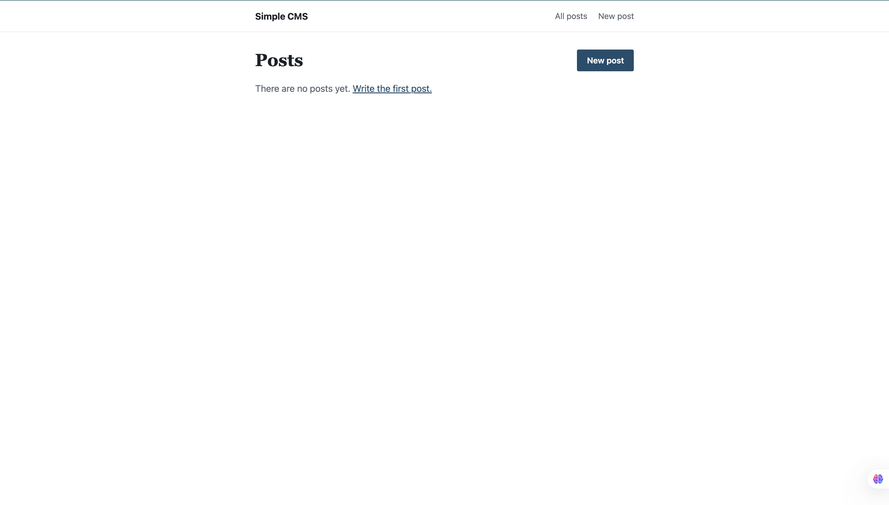
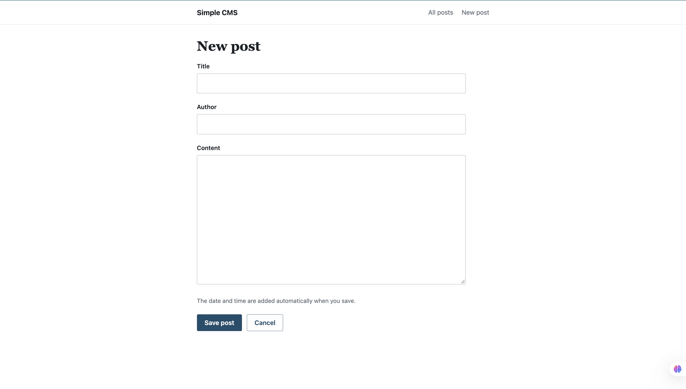
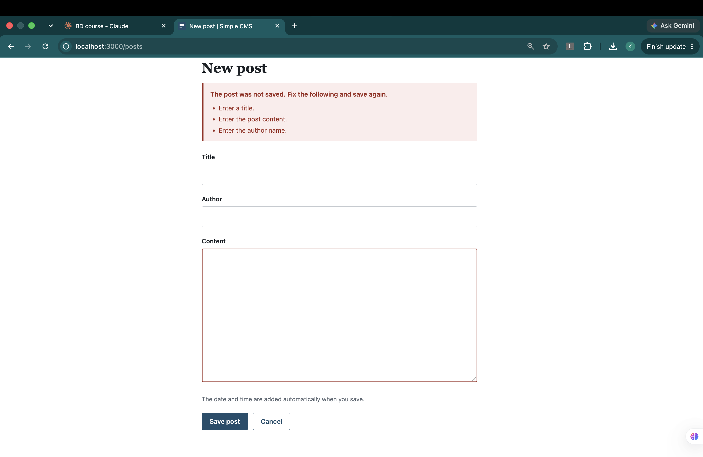
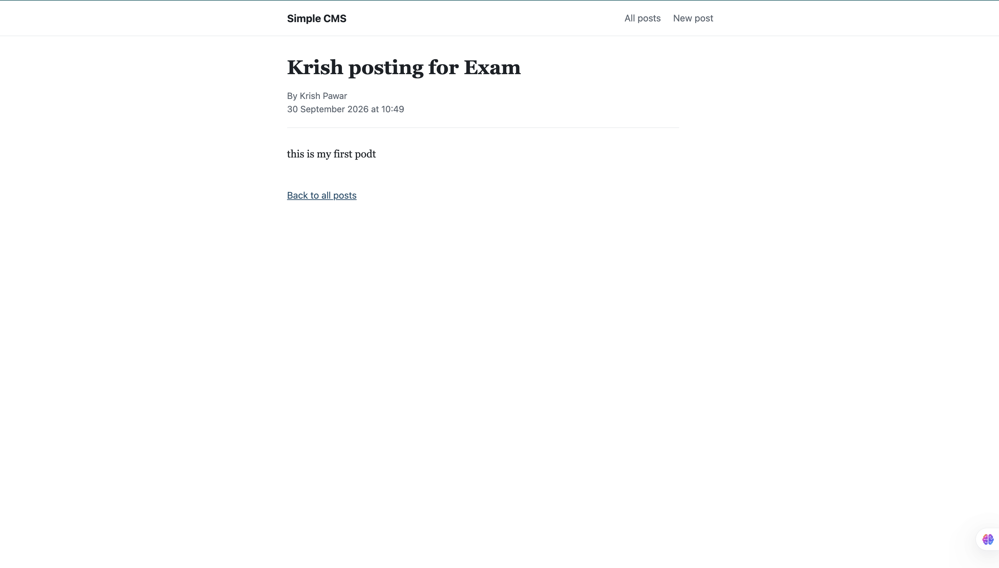

# Simple CMS: a blog application with Express, EJS and MongoDB

**Course:** Backend Development Lab
**Course Outcome Mapped:** CO_ *(fill in from the course handout)*
**Student:** Krish Pawar, B.Tech CSE, UPES Dehradun
**Date:** 30 September 2026

**Source:** [`app.js`](./app.js) and [`views/`](./views)

---

## Aim

To design and build a Blog Content Management System that renders its pages on the server using EJS and stores blog posts permanently in an existing MongoDB database. Users can create a post, see a list of all posts, and open a single post by clicking its title.

## Objectives

After completing this experiment, I am able to:

1. Connect an Express application to MongoDB with the native driver and reuse one client for all requests.
2. Render pages on the server with EJS templates, including shared partials.
3. Handle an HTML form with a POST route, validate it on the server and redirect after saving.
4. Generate values such as the creation date on the server instead of accepting them from the user.
5. Retrieve a single document by its MongoDB `_id` and handle invalid or unknown ids.
6. Keep list pages light by fetching only the fields they need.

## Problem statement

Develop a web application named **Simple CMS**. Each post has a title, content, author and creation date and time. The creation date and time are generated by the backend when the post is created, and the user never enters them.

| Requirement | How it is met |
|---|---|
| Home page lists all posts from MongoDB | `GET /` and `GET /posts` query the `posts` collection, newest first |
| List shows title, author and creation date | `posts.ejs` prints exactly these three values per post |
| Title of each post is clickable | Each title is a link to `/posts/<id>` |
| HTML form with title, content, author and a submit button | `new-post.ejs` |
| Validate title, content and author are not empty | `validatePost()` in `app.js` |
| Insert the post and generate the date on the server | `insertOne` with `createdAt: new Date()` |
| Redirect to the post list after saving | `res.redirect(303, "/posts")` |
| Individual post page found by unique id | `findOne({ _id: new ObjectId(id) })` |
| Complete content is not part of the list page | List query projects only title, author and createdAt |
| Server-side templates | EJS |
| Posts survive a refresh or a restart | Data is stored in MongoDB, nothing is kept in memory |

## Tools and environment

| Item | Detail |
|---|---|
| Runtime | Node.js |
| Framework | Express |
| Template engine | EJS |
| Database | MongoDB, running locally |
| Driver | `mongodb` (official Node.js driver) |
| Connection | `mongodb://127.0.0.1:27017`, database `cms_lab`, collection `posts` |
| Editor | Visual Studio Code |

---

## Theory

### Server-side rendering

In server-side rendering the server builds the finished HTML and sends it to the browser. The template holds the fixed markup and the server fills in the data. EJS does this with two tags: `<%= value %>` prints a value after escaping it, and `<% code %>` runs JavaScript such as a loop or an `if` without printing anything.

Escaping matters for a blog because users type the content. If a post contains `<script>`, `<%=` turns it into harmless text (`&lt;script&gt;`). The unescaped tag `<%-` would run it, so it is used only for `include`, which inserts trusted partial templates.

### Native driver and Mongoose

The previous experiment used Mongoose. This one uses the native driver, which has no schema layer: a document is saved exactly as it is passed. Because nothing checks the data automatically, the checks for empty fields, length and type have to be written in the route. The upside is less code between the application and the database, and this is the driver suggested for the task.

### ObjectId

MongoDB gives every document an `_id` of type `ObjectId`, a 24 character hexadecimal value. In a URL it is only a string, and the database compares types, so `findOne({ _id: "abc..." })` finds nothing. The string must be converted with `new ObjectId(id)` first, and a value that is not 24 hex characters must be rejected before conversion.

### POST, redirect, GET

After a form is saved, the server does not render a page. It answers with a redirect and the browser asks for the list with a new GET. If the server rendered the list directly, pressing refresh would send the same POST again and create a duplicate post. Status 303 states this intention: "go and fetch the result with GET".

### Validation on the server

The form fields carry `required`, but the browser only checks that the field is not empty. A field containing only spaces passes. A request sent from a script skips the browser entirely. The server is the only place that cannot be bypassed, so it repeats the checks.

---

## Procedure

1. Started MongoDB as a background service:
   ```bash
   brew services start mongodb-community@8.0
   ```
2. Created the project and installed the packages:
   ```bash
   mkdir cms-lab
   cd cms-lab
   npm init -y
   npm install express ejs mongodb
   ```
3. Wrote `app.js` with the MongoDB connection, the four routes, validation and error handling.
4. Wrote the templates `posts.ejs`, `new-post.ejs`, `post.ejs` and `error.ejs`, plus a shared header and footer in `views/partials`.
5. Added `public/style.css`.
6. Ran `npm start`, created posts through the form and checked every route.
7. Stopped and restarted the server to confirm the posts were still there.

## Application structure

```
cms-lab/
├── app.js
├── package.json
├── views/
│   ├── posts.ejs
│   ├── new-post.ejs
│   ├── post.ejs
│   ├── error.ejs
│   └── partials/
│       ├── header.ejs
│       └── footer.ejs
└── public/
    └── style.css
```

---

## Code walkthrough

### One connection, shared by all requests

```javascript
const client = new MongoClient(MONGO_URL);
let postsCollection;

async function start() {
  await client.connect();
  postsCollection = client.db(DB_NAME).collection(COLLECTION_NAME);
  app.listen(PORT, () => { /* ... */ });
}
```

The client is created once. The server begins listening only after the connection succeeds, so no request can arrive while `postsCollection` is still undefined. If MongoDB is not running, the program prints a clear message and exits instead of starting a server that fails on every page.

### Listing posts without the content

```javascript
const posts = await postsCollection
  .find({}, { projection: { title: 1, author: 1, createdAt: 1 } })
  .sort({ createdAt: -1 })
  .toArray();
```

The projection asks MongoDB to return only three fields, so the content never leaves the database for the list page. `sort({ createdAt: -1 })` puts the newest post first.

### Creating a post

```javascript
app.post("/posts", async (req, res) => {
  const { values, errors } = validatePost(req.body || {});

  if (Object.keys(errors).length > 0) {
    return res.status(400).render("new-post", { values, errors });
  }

  await postsCollection.insertOne({
    title: values.title,
    content: values.content,
    author: values.author,
    createdAt: new Date(),
  });

  res.redirect(303, "/posts");
});
```

Only title, content and author are read from the form. `createdAt` is set on the server, so a user cannot choose or fake it, even by adding an extra field to the request. When validation fails, the form is shown again with status 400, the messages, and the values the user had typed.

### Validation

```javascript
function readField(value) {
  return typeof value === "string" ? value.trim() : "";
}
```

`trim()` removes leading and trailing spaces, so a title made only of spaces becomes empty and is rejected. The `typeof` check handles requests where a field arrives as an array or object instead of text.

### Opening one post

```javascript
if (!/^[0-9a-fA-F]{24}$/.test(id)) {
  return res.status(404).render("error", { status: 404, message: "That post link is not valid." });
}
const post = await postsCollection.findOne({ _id: new ObjectId(id) });
```

An id that is not 24 hex characters gets a 404 page instead of crashing the server. A well formed id that matches no document also gets a 404.

### Route order

`GET /posts/new` is declared before `GET /posts/:id`. Express matches routes in order, so if the order were reversed, the word `new` would be treated as an id.

---

## Test cases

Run each case and compare the result with the last column.

| Test | Action | Expected result |
|---|---|---|
| List with no data | Open `/` on an empty collection | Message that there are no posts, with a link to create one |
| Create a post | Fill all three fields and press Save post | Redirect to the list, new post at the top |
| Automatic date | Look at the new post in the list | Today's date is shown, and the form had no date field |
| Empty fields | Submit with a field left empty | Browser stops the submit |
| Spaces only | Type spaces in every field and submit | Form shown again with an error for each field |
| Values kept | Fill only the title and submit | Error messages appear and the title is still in the box |
| Clickable title | Click a title in the list | Opens `/posts/<id>` with the complete post |
| Content hidden in list | View the list page source | No post content in the HTML |
| Persistence | Refresh the page, then stop and restart the server | All posts are still listed |
| Refresh after save | Press refresh right after saving a post | No duplicate post is created |
| Bad id | Open `/posts/abc` | 404 page, server keeps running |
| Unknown id | Open `/posts/000000000000000000000000` | 404 page |
| Escaping | Create a post with `<b>bold</b>` as the title | The tags are shown as text, not applied |

---

## Output

Screenshots of the running application.

**Post list**



**Create-post form**



**Validation error**



**Single post**



---

## Observations

1. **The date is server data, not form data.** Because `createdAt` is set inside the route, the value is the same for every user and cannot be changed from the browser.
2. **`required` is not enough.** A field with only spaces passes the browser check. Trimming and checking on the server is what actually rejects it.
3. **Redirect after POST prevents duplicates.** Rendering the list straight after the insert would make a refresh submit the form again.
4. **The projection keeps the list page small.** The list fetches three fields per post. Long content is loaded only for the post that is opened.
5. **Invalid ids must be handled before the query.** Passing an arbitrary string to `new ObjectId()` throws an error, which would otherwise become a server error page for a simple typing mistake in the URL.
6. **The native driver gives no automatic checks.** Every rule that Mongoose would have enforced through a schema is written by hand here.
7. **Line breaks in content are kept with CSS.** The text is escaped by EJS, and `white-space: pre-wrap` on the content block shows the paragraphs as they were typed.

---

## Conclusion

A working Simple CMS was built with Express, EJS and the MongoDB native driver. Posts are created through a validated form, stored permanently in the `cms_lab.posts` collection, listed newest first with only their title, author and date, and opened one at a time by `_id`. The creation date is generated by the server, saving is followed by a redirect, and invalid ids and empty fields are handled without errors. All six objectives were met.

---

## References

1. MongoDB, *Node.js Driver documentation*. <https://www.mongodb.com/docs/drivers/node/current/>
2. Express, *Using template engines*. <https://expressjs.com/en/guide/using-template-engines.html>
3. EJS, *Documentation*. <https://ejs.co/>
4. MDN, *Post/Redirect/Get and 303 See Other*. <https://developer.mozilla.org/en-US/docs/Web/HTTP/Reference/Status/303>

---

[Back to repository index](../../../)
